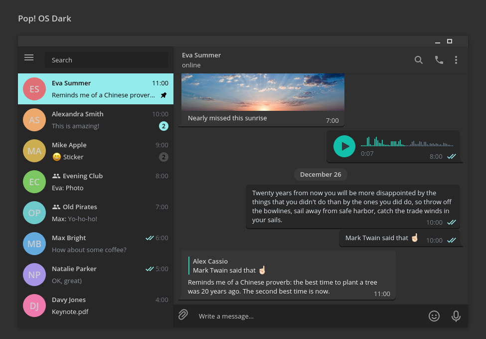
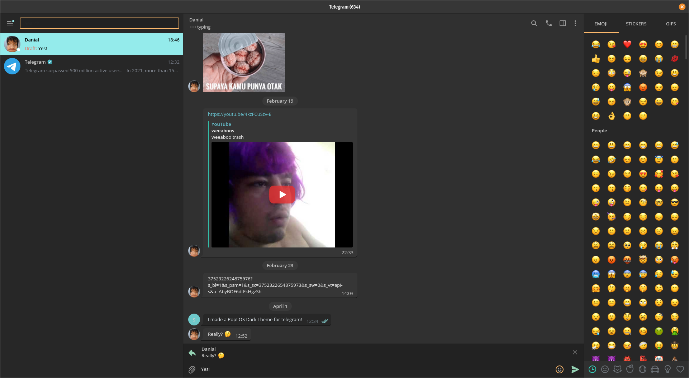

# Pop! OS Dark theme for Telegram
This repository dedicated to develop Pop! OS Dark theme in Telegram.

## Install
Telegram Theme link: https://t.me/addtheme/PopOSDarkTheme

or

Download `colors.tdesktop-theme` and `background.png` from this repo and import them at **Settings>Chat Settings>Three Dots (...)>Import Existing Theme**

## Contribution
The theme is currently a work in progress, feel free to create a pull request for any fixes or changes to improve the theme :D
